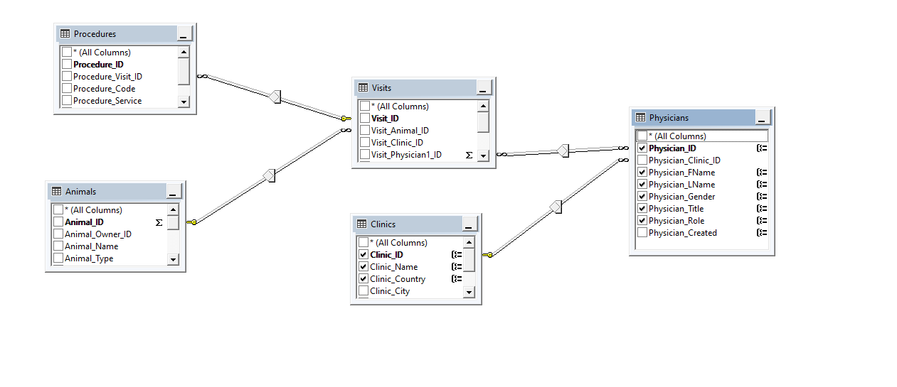

# Pet Clinic Database Structure 
Microsoft SQL Server 2019 Database for Managing Pets Clinic's Visits and Physicians Costs

- Installation
    - Database Files
        - [MDF main data file](/Database-Files/PetClinic.mdf)
        - [LDF log data file](/Database-Files/PetClinic_log.ldf)
    - Full Script Instaltion
        - [Full Database Structure Create SQL](/SQL-Query/Full-Database-Structure-Create.sql)
- [Database Schema](#Database-Schema)
    - [Owners (TABLE Owners)](#Owners-TABLE-Owners)
    - [Animals (TABLE Animals)](#Animals-TABLE-Animals)
    - [Clinics (TABLE Clinics)](#Clinics-TABLE-Clinics)
    - [Physicians (TABLE Physicians)](#Physicians-TABLE-Physicians)
    - [Visits (TABLE Visits)](#Visits-TABLE-Visits)
    - [Procedures (TABLE Procedures)](#Procedures-TABLE-Procedures)
- [Database Image Structure](#Database-Image-Structure)
- [Views Queries](#Views-Queries)
    - [Animal Full View](#Animal-Full-View)
    - [Visits Full Costs View](#Visits-Full-Costs-View)
- [Functions Inline Tables](#Functions-Inline-Tables)
    - [Physicians Cost Report](#Physicians-Cost-Report)


## Database Schema 

### Owners (TABLE Owners)
> Holds all information about Pets Owners

- Owner_ID [int] IDENTITY(1,1) NOT NULL, `# PRIMARY KEY CLUSTERED`
- Owner_FName [nvarchar(50)] NOT NULL, `# NONCLUSTERED INDEX [IX_Owners_1]`
- Owner_LName [nvarchar(50)] NOT NULL, `# NONCLUSTERED INDEX [IX_Owners_2]`
- Owner_Phone [nvarchar(50)] NOT NULL, `# NONCLUSTERED INDEX [IX_Owners_3]`
- Owner_Email [nvarchar(50)] NULL, `# NONCLUSTERED INDEX [IX_Owners_4]`
- Owner_License_Num [nvarchar(50)] NULL,
- Owner_License_Type [nvarchar(50)] NULL,
- Owner_Country [nvarchar(50)] NULL,
- Owner_City [nvarchar(50)] NULL,
- Owner_Address [nvarchar(max)] NULL,
- Owner_Payment_Type [nvarchar(50)] NULL,
- Owner_Created [datetime] NOT NULL,

### Animals (TABLE Animals)
> Holds all information about Pets and its releational with Owners Table

- Animal_ID [int] IDENTITY(1,1) NOT NULL, `# PRIMARY KEY CLUSTERED`
- Animal_Owner_ID [int] NULL, `>> Forgien Key with` [Owners.Owner_ID](#Owners-TABLE-Owners)
- Animal_Name [nvarchar(200)] NOT NULL, `# NONCLUSTERED INDEX [IX_Animals_1]`
- Animal_Type [nvarchar(50)] NOT NULL, `# NONCLUSTERED INDEX [IX_Animals_2]`
- Animal_Species [nvarchar(50)] NULL, `# NONCLUSTERED INDEX [IX_Animals_3]`
- Animal_Gender [nvarchar(50)] NOT NULL, `# NONCLUSTERED INDEX [IX_Animals_4]`
- Animal_Color [nvarchar(50)] NOT NULL,
- Animal_BrithDate [date] NOT NULL, `# NONCLUSTERED INDEX [IX_Animals_5]`
- Animal_Status [nvarchar(50)] NULL,
- Animal_Admited [int] NOT NULL,
- Animal_Info [nvarchar(max)] NULL,
- Animal_Created [datetime] NOT NULL,


### Clinics (TABLE Clinics)
> Holds all information about Clinics

- Clinic_ID [int] IDENTITY(1,1) NOT NULL, `# PRIMARY KEY CLUSTERED`
- Clinic_Name [nvarchar(50)] NOT NULL, `# NONCLUSTERED INDEX [IX_Clinics_1]`
- Clinic_Country [nvarchar(50)] NULL, `# NONCLUSTERED INDEX [IX_Clinics_2]`
- Clinic_City [nvarchar(50)] NULL, `# NONCLUSTERED INDEX [IX_Clinics_3]`
- Clinic_State [nvarchar(50)] NULL, `# NONCLUSTERED INDEX [IX_Clinics_4]`
- Clinic_Address [nvarchar(max)] NULL,
- Clinic_Created [datetime] NOT NULL,


### Physicians (TABLE Physicians)
> Holds all information about Physicians and its relational with Clinics

- Physician_ID [int] IDENTITY(1,1) NOT NULL, `# PRIMARY KEY CLUSTERED`
- Physician_Clinic_ID [int] NOT NULL, `>> Forgien Key with` [Clinics.Clinic_ID](#Clinics-TABLE-Clinics)
- Physician_FName [nvarchar(50)] NULL, `# NONCLUSTERED INDEX [IX_Physicians_1]`
- Physician_LName [nvarchar(50)] NOT NULL, `# NONCLUSTERED INDEX [IX_Physicians_2]`
- Physician_Gender [nvarchar(50)] NOT NULL, `# NONCLUSTERED INDEX [IX_Physicians_3]`
- Physician_Title [nvarchar(250)] NULL,
- Physician_Role [nvarchar(50)] NULL,
- Physician_Created [datetime] NOT NULL,


### Visits (TABLE Visits)
> Holds all information about Visits and its relational with Animals, Clinics and Physicians

- Visit_ID [int] IDENTITY(1,1) NOT NULL, `# PRIMARY KEY CLUSTERED`
- Visit_Animal_ID [int] NOT NULL, `>> Forgien Key with` [Animals.Animal_ID](#Animals-TABLE-Animals)
- Visit_Clinic_ID [int] NOT NULL, `>> Forgien Key with` [Clinics.Clinic_ID](#Clinics-TABLE-Clinics)
- Visit_Physician1_ID [int] NOT NULL, `>> Forgien Key with` [Physicians.Physician1_ID](#Physicians-TABLE-Physicians)
- Visit_Physician2_ID [int] NULL, `>> Forgien Key with` [Physicians.Physician2_ID](#Physicians-TABLE-Physicians)
- Visit_Date [datetime] NOT NULL, `# NONCLUSTERED INDEX [IX_Visits_1]`
- Visit_Status [int] NOT NULL,
- Visit_Info [nvarchar(max)] NULL,


### Procedures (TABLE Procedures)
> Holds all information about Procedures and its relational with Visits

- Procedure_ID [int] IDENTITY(1,1) NOT NULL, `# PRIMARY KEY CLUSTERED`
- Procedure_Visit_ID [int] NOT NULL, `>> Forgien Key with` [Visits.Visit_ID](#Visits-TABLE-Visits)
- Procedure_Code [nvarchar(50)] NOT NULL, `# NONCLUSTERED INDEX [IX_Procedures_1]`
- Procedure_Service [nvarchar(250)] NOT NULL, `# NONCLUSTERED INDEX [IX_Procedures_2]`
- Procedure_Disc [nvarchar(max)] NULL,
- Procedure_Cost [decimal(18,2)] NOT NULL,


## Database Image Structure
 

## Views Queries 
> Views and Explanation in sql

### Animal Full View
> combine  2 Tables [Owners](#Owners-TABLE-Owners) AND [Animals](#Animals-TABLE-Animals)

#### Query
```
SELECT  (100) PERCENT Animals.Animal_ID, Animals.Animal_Owner_ID, Animals.Animal_Name, Animals.Animal_Type, 
            Animals.Animal_Species, Animals.Animal_Gender, Animals.Animal_Color, Animals.Animal_BrithDate, 
            Animals.Animal_Status, Animals.Animal_Admited, Animals.Animal_Info, Animals.Animal_Created, 
            Owners.Owner_FName, Owners.Owner_LName, Owners.Owner_Phone, Owners.Owner_Payment_Type, 
            Owners.Owner_City, Owners.Owner_Country, Owners.Owner_Address

FROM   Animals INNER JOIN
            Owners ON Animals.Animal_Owner_ID = Owners.Owner_ID
```
#### Explanation
> The `INNER JOIN` keyword selects records that have matching values in both tables [Owners](#Owners-TABLE-Owners) and [Animals](#Animals-TABLE-Animals) with forgein key `Owners.Owner_ID` to display Animals with its owners informations

#### Query Structure

 

#### Sample Results
 

### Visits Full Costs View
> combine  2 Tables [Owners](#Owners-TABLE-Owners) AND [Animals](#Animals-TABLE-Animals)

#### Query
```
SELECT  TOP (100) PERCENT dbo.Procedures.Procedure_ID, dbo.Procedures.Procedure_Code, 
            dbo.Procedures.Procedure_Service, dbo.Procedures.Procedure_Cost, dbo.Visits.Visit_ID, 
            dbo.Visits.Visit_Date, dbo.Visits.Visit_Status, dbo.Visits.Visit_Info, dbo.Animals.Animal_ID, 
            dbo.Animals.Animal_Name, dbo.Animals.Animal_Type, dbo.Animals.Animal_Species, dbo.Animals.Animal_Gender, 
            dbo.Animals.Animal_Color, dbo.Animals.Animal_BrithDate, dbo.Animals.Animal_Status, 
            dbo.Animals.Animal_Admited, dbo.Animals.Animal_Info, dbo.Animals.Animal_Created, 
            dbo.Owners.Owner_FName, dbo.Owners.Owner_LName, 
            CONCAT(dbo.Owners.Owner_FName, ' ', dbo.Owners.Owner_LName) AS Owner_Name,  dbo.Owners.Owner_Country, 
            dbo.Owners.Owner_Address, dbo.Owners.Owner_Phone, dbo.Physicians.Physician_ID, 
            dbo.Physicians.Physician_FName, dbo.Physicians.Physician_LName, 
            CONCAT(dbo.Physicians.Physician_FName, ' ', dbo.Physicians.Physician_LName) AS Physician_Name, 
            dbo.Physicians.Physician_Gender, dbo.Physicians.Physician_Title, dbo.Clinics.Clinic_ID, 
            dbo.Clinics.Clinic_Name, dbo.Clinics.Clinic_Country, dbo.Clinics.Clinic_City, dbo.Clinics.Clinic_Address
FROM    dbo.Procedures INNER JOIN
            dbo.Visits ON dbo.Procedures.Procedure_Visit_ID = dbo.Visits.Visit_ID LEFT OUTER JOIN
            dbo.Animals ON dbo.Visits.Visit_Animal_ID = dbo.Animals.Animal_ID LEFT OUTER JOIN
            dbo.Physicians ON dbo.Visits.Visit_Physician1_ID = dbo.Physicians.Physician_ID LEFT OUTER JOIN
            dbo.Clinics ON dbo.Visits.Visit_Clinic_ID = dbo.Clinics.Clinic_ID LEFT OUTER JOIN
            dbo.Owners ON dbo.Animals.Animal_Owner_ID = dbo.Owners.Owner_ID
```
#### Explanation
1- List all Procedures that matches with all visits for animals
> The `INNER JOIN` keyword selects records that have matching values in both tables [Procedures](#Procedures-TABLE-Procedures) and [Visits](#Visits-TABLE-Visits)

2- LEFT JOIN Visits with Animals, Physicians, Clinics and Owners Tables to view nessasry information
> The `LEFT JOIN` keyword returns all records from the left table [Visits](#Visits-TABLE-Visits), and the matching records from the right table [Animals](#Animals-TABLE-Animals). 

> The `LEFT JOIN` keyword returns all records from the left table [Visits](#Visits-TABLE-Visits), and the matching records from the right table [Physicians](#Physicians-TABLE-Physicians). 

> The `LEFT JOIN` keyword returns all records from the left table [Visits](#Visits-TABLE-Visits), and the matching records from the right table [Clinics](#Clinics-TABLE-Clinics). 

> The `LEFT JOIN` keyword returns all records from the left table [Animals](#Animals-TABLE-Animals), and the matching records from the right table [Owners](#Owners-TABLE-Owners). 

#### Query Structure

 

#### Sample Results
- Page 1
 
- Page 2
 


## Functions Inline Tables 
> Inline tables with function to pass arguments and return results based on those argments

### Physicians Cost Report
> Created `dbo.fn_Physicians_Report` that holds a query selector with argments (`@YearStart`, `@YearEnd`, `@Age`)

> View full report for both of 2 Physicians on [Visits](#Visits-TABLE-Visits) Table (`Visit_Physician1_ID`, `Visit_Physician2_ID`) and `UNION` all returned results

#### Arguments
- `@YearStart` [date] # calculate costs based on animal visits on larger or equal than start date
- `@YearEnd` [date] # calculate costs based on animal visits on smaller or than end date
- `@Age` [int] # calculate costs based on animal age that below @Age Number

#### Query
```
SELECT      Physicians.Physician_ID, Physicians.Physician_FName, Physicians.Physician_LName, CONCAT(dbo.Physicians.Physician_FName, ' ', dbo.Physicians.Physician_LName) AS Physician_Name, 'P1' AS Physician_Posstion
			,Physicians.Physician_Gender, Physicians.Physician_Title, Physicians.Physician_Role, 
			Clinics.Clinic_ID, Clinics.Clinic_Name, Clinics.Clinic_Country, 
			COUNT(DISTINCT(Animals.Animal_ID)) AS Animal_Volume, 
			COUNT(Visits.Visit_Physician1_ID) AS Visit_Frequancy, 
			ISNULL(SUM(Procedures.Procedure_Cost),0) AS Procedure_Sum_Cost, 
			@YearStart AS Year_Start ,@YearEnd AS Year_End , @Age AS Pet_Under_Age
FROM            Physicians LEFT OUTER JOIN
                         Clinics ON Physicians.Physician_Clinic_ID = Clinics.Clinic_ID LEFT OUTER JOIN
                         Visits ON Physicians.Physician_ID = Visits.Visit_Physician1_ID LEFT OUTER JOIN
                         Procedures ON Visits.Visit_ID = Procedures.Procedure_Visit_ID LEFT OUTER JOIN
                         Animals ON Visits.Visit_Animal_ID = Animals.Animal_ID

WHERE Visits.Visit_Date >= @YearStart AND Visits.Visit_Date <= @YearEnd 
AND DATEDIFF(YEAR, Animals.Animal_BrithDate, GETDATE()) < @Age

GROUP BY Physicians.Physician_ID, Physicians.Physician_FName, Physicians.Physician_LName, Physicians.Physician_Gender, Physicians.Physician_Title, Physicians.Physician_Role, Physicians.Physician_Created, Clinics.Clinic_ID, Clinics.Clinic_Name, 
                         Clinics.Clinic_Country
UNION ALL 

SELECT      Physicians.Physician_ID, Physicians.Physician_FName, Physicians.Physician_LName, CONCAT(dbo.Physicians.Physician_FName, ' ', dbo.Physicians.Physician_LName) AS Physician_Name, 'P2' AS Physician_Posstion
			,Physicians.Physician_Gender, Physicians.Physician_Title, Physicians.Physician_Role, 
			Clinics.Clinic_ID, Clinics.Clinic_Name, Clinics.Clinic_Country, 
			COUNT(DISTINCT(Animals.Animal_ID)) AS Animal_Volume, 
			COUNT(Visits.Visit_Physician2_ID) AS Visit_Frequancy, 
			ISNULL(SUM(Procedures.Procedure_Cost),0) AS Procedure_Sum_Cost, 
			@YearStart AS Year_Start ,@YearEnd AS Year_End , @Age AS Pet_Under_Age
FROM            Physicians LEFT OUTER JOIN
                         Clinics ON Physicians.Physician_Clinic_ID = Clinics.Clinic_ID LEFT OUTER JOIN
                         Visits ON Physicians.Physician_ID = Visits.Visit_Physician2_ID LEFT OUTER JOIN
                         Procedures ON Visits.Visit_ID = Procedures.Procedure_Visit_ID LEFT OUTER JOIN
                         Animals ON Visits.Visit_Animal_ID = Animals.Animal_ID

WHERE Visits.Visit_Date >= @YearStart AND Visits.Visit_Date <= @YearEnd 
AND DATEDIFF(YEAR, Animals.Animal_BrithDate, GETDATE()) < @Age


GROUP BY Physicians.Physician_ID, Physicians.Physician_FName, Physicians.Physician_LName, Physicians.Physician_Gender, Physicians.Physician_Title, Physicians.Physician_Role, Physicians.Physician_Created, Clinics.Clinic_ID, Clinics.Clinic_Name, Clinics.Clinic_Country
```
#### Explanation
> USING `UNION ALL` to Merage `Visit_Physician1_ID` and `Visit_Physician2_ID` Resulats in same rows view

1- List all Physicians and Joining with ([Clinics](#Clinics-TABLE-Clinics), [Visits](#Visits-TABLE-Visits), [Animals](#Animals-TABLE-Animals), [Procedures](#Procedures-TABLE-Procedures)) Tables

2- `CONCAT` Physicians (`Physician_FName` and `Physician_LName`) AS `Physician_Name`

3- Define 'P1' and 'P2' AS Physician_Posstion to separate `Visit_Physician1_ID` from `Visit_Physician2_ID`

4- Count Animal_ID from [Visits](#Visits-TABLE-Visits) Table to detremin the animals visit volume `COUNT(DISTINCT(Animals.Animal_ID)) AS Animal_Volume`

5- Count `Visit_Physician1_ID` OR `Visit_Physician2_ID` ON the UNION ALL from [Visits](#Visits-TABLE-Visits) Table to detremin the Visit Frequancy `COUNT(Visits.Visit_Physician1_ID) AS Visit_Frequancy` 

6- Sum Procedure Cost to detremin Actual cost of the Physician `ISNULL(SUM(Procedures.Procedure_Cost),0) AS Procedure_Sum_Cost` 

> Using `ISNULL` To insure that return value will be 0 if thier is no data on [Procedures](#Procedures-TABLE-Procedures) Table

7- LEFT JOIN Physicians with Visits, Animals, Procedures, and Clinics Tables to gather nessasry information
> The `LEFT JOIN` keyword returns all records from the left table [Physicians](#Physicians-TABLE-Physicians), and the matching records from the right table [Clinics](#Clinics-TABLE-Clinics). 

> The `LEFT JOIN` keyword returns all records from the left table [Physicians](#Physicians-TABLE-Physicians), and the matching records from the right table [Visits](#Visits-TABLE-Visits). 

> The `LEFT JOIN` keyword returns all records from the left table [Visits](#Visits-TABLE-Visits), and the matching records from the right table [Procedures](#Procedures-TABLE-Procedures). 

> The `LEFT JOIN` keyword returns all records from the left table [Physicians](#Physicians-TABLE-Physicians), and the matching records from the right table [Clinics](#Clinics-TABLE-Clinics). 

> The `LEFT JOIN` keyword returns all records from the left table [Visits](#Visits-TABLE-Visits), and the matching records from the right table [Animals](#Animals-TABLE-Animals). 

8- WHERE Condetions 
- Using the  Argmetns (`@YearStart`, `@YearEnd`) to reduce database rows matching
> Using stament After Where `Visits.Visit_Date >= @YearStart AND Visits.Visit_Date <= @YearEnd` to get all results that match all dates from visits that is larger or equal to the `@YearStart` and smaller than `@YearEnd`  . 

- Using the  Argmetns (`@Age`) to reduce database rows matching
> Using stament After Where `DATEDIFF(YEAR, Animals.Animal_BrithDate, GETDATE()) < @Age`

> `DATEDIFF` for getting the date diffrance beween 2 date and in our condtion is Time now `GETDATE()` and the Pet Birthdate `Animals.Animal_BrithDate`

9- GROUP Table By View columns to conssets with `COUNT` and `SUM` functions
> Grob BY `Physicians.Physician_ID, Physicians.Physician_FName, Physicians.Physician_LName, Physicians.Physician_Gender, Physicians.Physician_Title, Physicians.Physician_Role, Physicians.Physician_Created, Clinics.Clinic_ID, Clinics.Clinic_Name, Clinics.Clinic_Country` to can view agregation function (`COUNT`, `SUM`)

#### Query Usage
```
USE [PetClinic]
DECLARE @YearEnd DATE
SET @YearEnd = '12/31/2022'

DECLARE @Age INT
SET @Age = 3

SELECT *  FROM   dbo.fn_Physicians_Report(@YearStart, @YearEnd, @Age) Order BY Physician_ID

```

#### Query Structure
 

#### Sample Results
 


